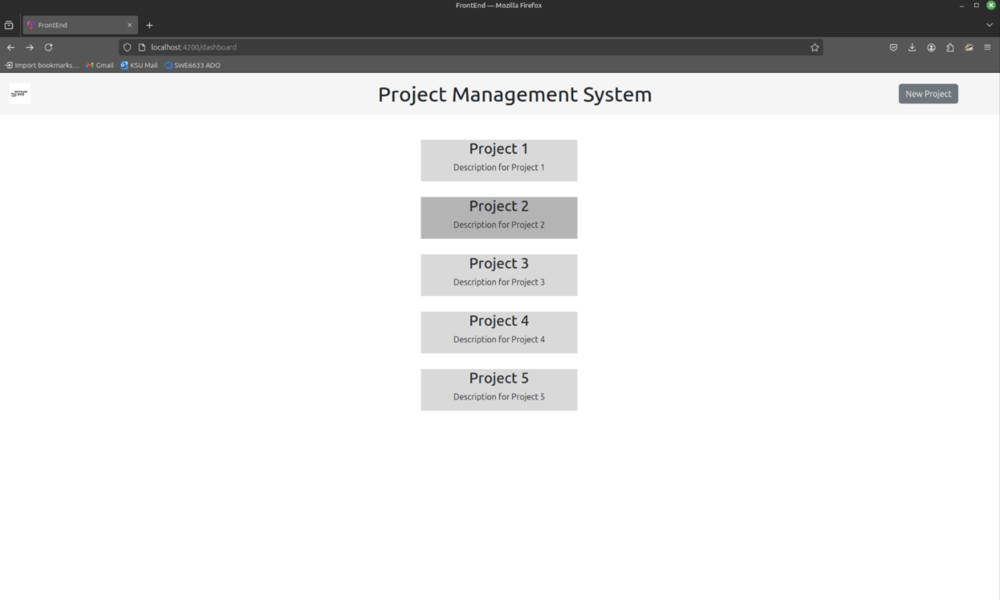
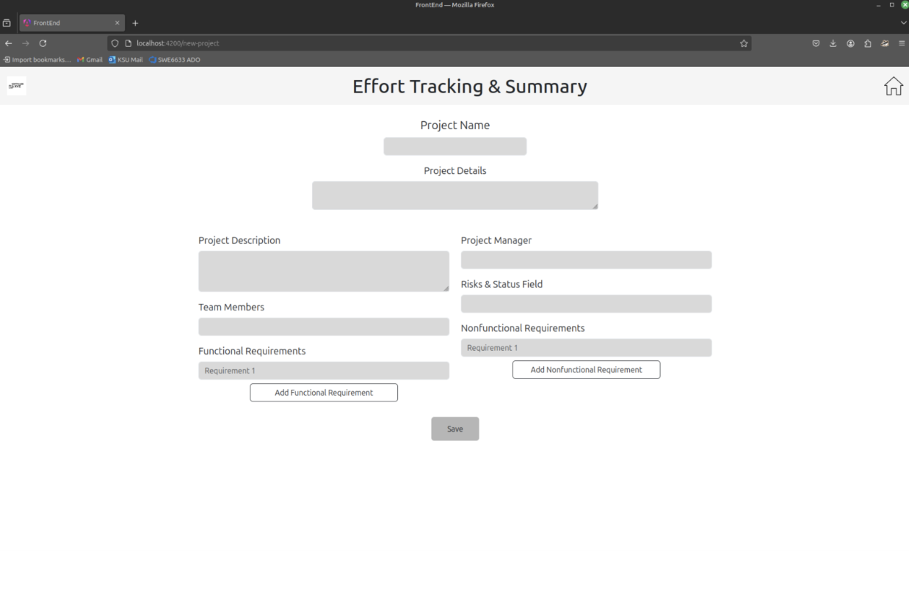
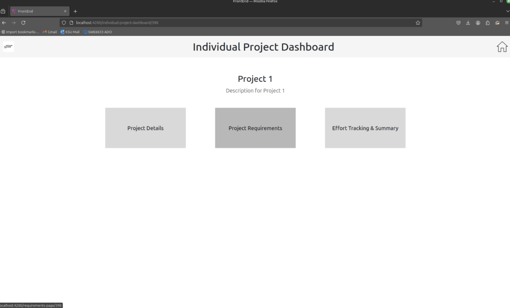
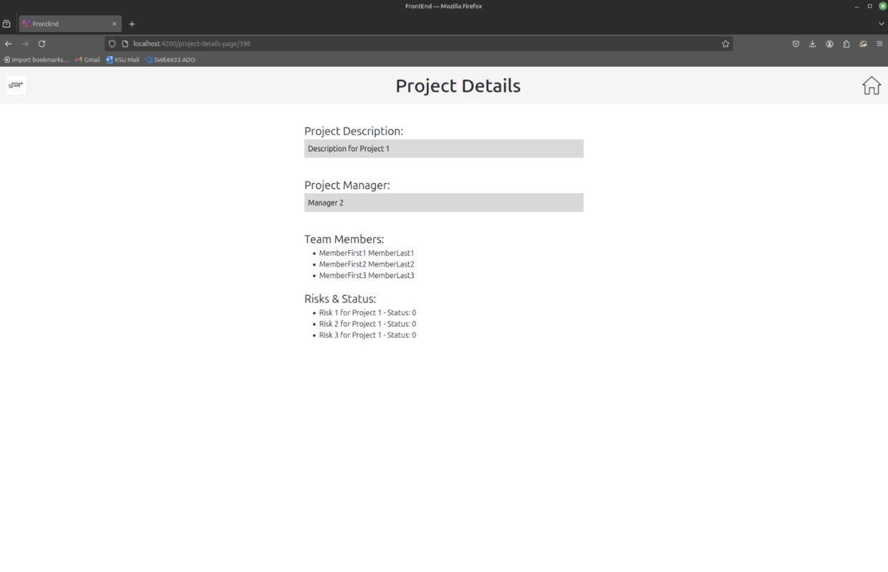
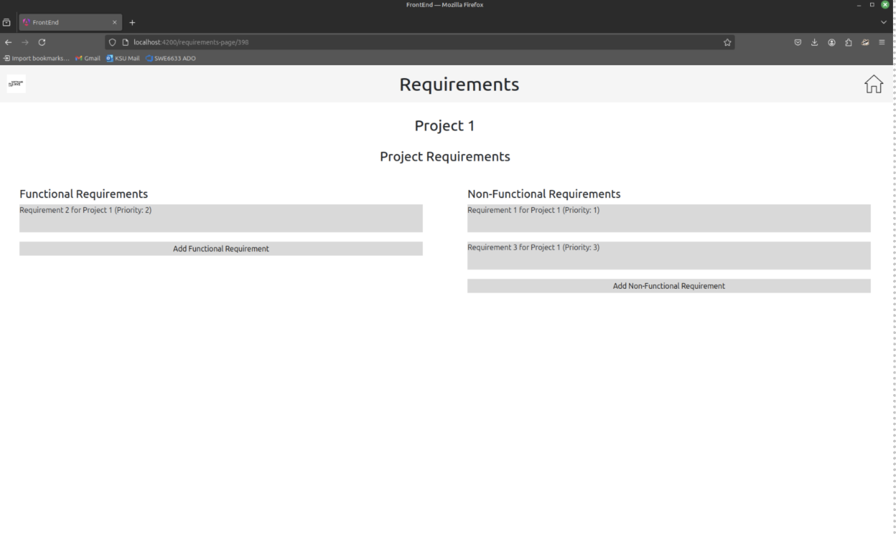
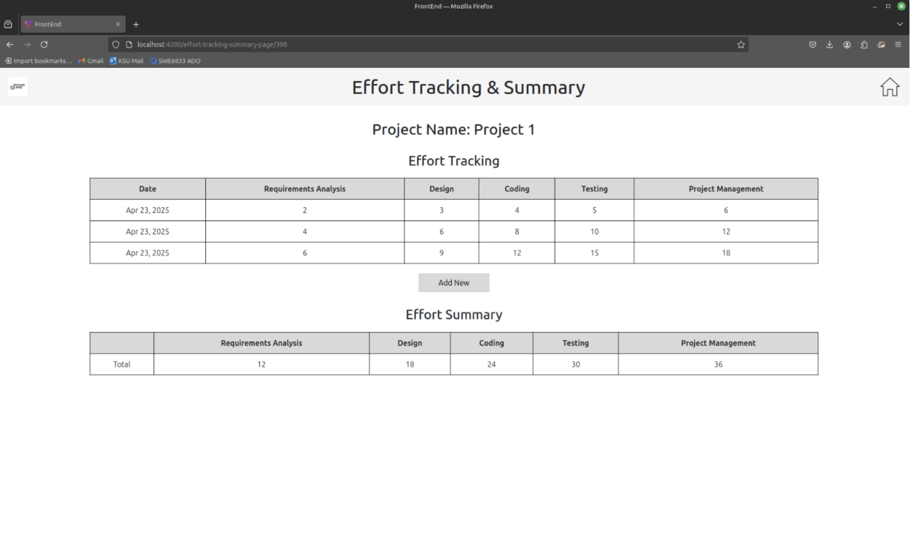

# Project Management Web Application

A web-based project management tool developed for **SWE 6633 - Software Project Planning and Management (Spring 2025)**.

---

## Getting Started

### Prerequisites

To run the application locally, you will need:

- Java 18 installed  
- Node.js and npm installed  
- Gradle installed  
- Angular CLI installed

---

### Installation

You can either:

- Unzip the provided zip folder of the source code, **or**
- Clone the repository:

```bash
git clone https://github.com/kokoAfantchao/Group-1-Software-Project-PlanMgt-Spring-Semester-2025
```

---

### Running the Backend

1. Open a terminal window.
2. Navigate to the backend directory:

```bash
cd Back-End
```

3. Build the backend (skipping tests to save time):

```bash
./gradlew build -x test
```

4. Once you see `BUILD SUCCESSFUL`, run the backend:

```bash
./gradlew bootRun
```

5. Wait for the message:

```
Started PmApplicationKt in 52.148 seconds
```

6. Open a browser and go to:

```
http://localhost:8080/api/hello
```

You should see a `Hello world` JSON message.

> **Note:** Keep the backend running while working with the frontend.

---

### Running the Frontend

1. Open a **new** terminal window.
2. Navigate to the frontend directory:

```bash
cd Front-End
```

3. Install dependencies:

```bash
npm install
```

4. Start the frontend server:

```bash
ng serve
```

5. Visit:

```
http://localhost:4200/dashboard
```

in your browser to access the dashboard.

🎉 Congratulations — the app is now running locally!

---

## Website (If Hosted)

*(Add a live hosted link here if the application is deployed.)*

---

## Application Overview

### Account Creation and Login

- Users can create an account and log in to access the dashboard and manage projects.

---

## Navigation & Interface

Here’s a quick look at the main screens of the application:

### Dashboard

Return to the dashboard anytime by clicking the logo in the top-left corner.



---

### New Project Page

Create a new project. (The home button in the top-right corner also returns to the dashboard.)



---

### Project Selection

View all existing projects and select one to view more details.



---

### Project Details

Access detailed information about a selected project.



---

### Project Requirements

View and manage the requirements associated with a project.



---

### Effort Tracking and Summary

Track effort spent on different activities, and view the automatic effort summary table.



---

## Known Issues

- "Add New" buttons (add project, requirement, effort, etc.) are **currently not functional**.

---

## Repository

🔗 [GitHub Repository](https://github.com/kokoAfantchao/Group-1-Software-Project-PlanMgt-Spring-Semester-2025)
